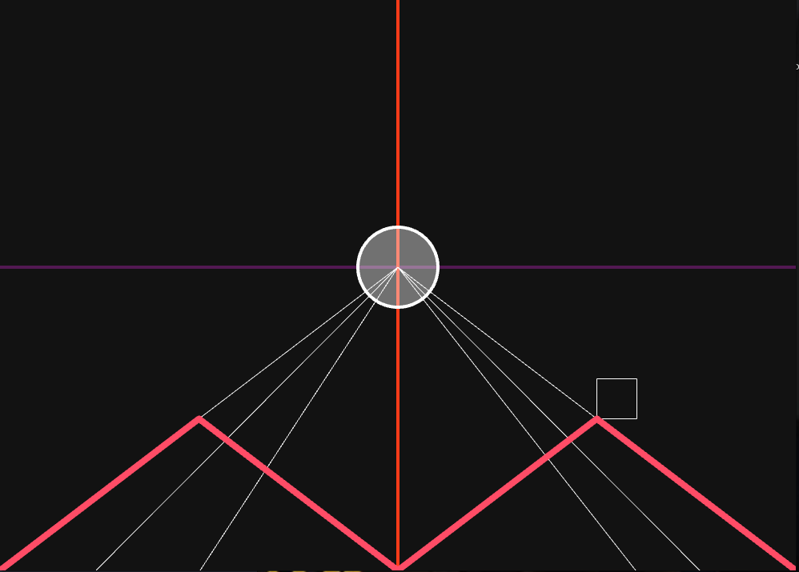

# KIVY - KIVYMD -KAKI (for hot reload)
> how to run this app
```sh
DEBUG=1 python3 main.py

```
# BASICS OF CANVA


```py
 Widget:
        id:gammer
        x1:200.1
        canvas:
            Color:
                rgba:(.32,.1,.32,1)
            Line:
                width:2
                points:(0,self.height/2,self.width,self.height/2)
            Color:
                rgba:(1,.23,.1,1)
            Line:
                points:(self.width/2,0, self.width/2, self.height)
                width:2
            Color:
                rgba:(1,1,1,.4)
            Ellipse:
                pos:(self.width/2-50,self.height/2-50)
                size:100,100
            Color:
                rgba:(1,1,1,1)
            Line:
                circle:(self.width/2,self.height/2,50)
                width:2
            Line:
                rectangle:(((self.width/2)*2)-(self.width/2)/2,(self.height/2)/2,50,50)
            Line:
                points:(0,0,self.width/2,self.height/2)
            Line:
                points:(self.width/2,self.height/2,self.width,0)
            Line:
                points:(120,0,self.width/2,self.height/2)
            Line:
                points:(self.width/2,self.height/2,self.width-120,0)
            Line:
                points:(250,0,self.width/2,self.height/2)
            Line:
                points:(self.width/2,self.height/2,self.width-200,0)
            Color:
                rgba:(1,.3,.4,1)
            Line:
                # points:(0,0,self.height,self.width)
                points:(0,0,self.width/4,self.height/4, self.width/2,0,self.width*3/4,self.height/4,self.width,0)
                width:4.0

```
